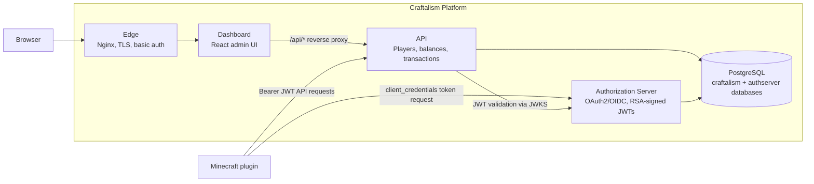

# Craftalism

[](https://openjdk.org/)
[](https://spring.io/projects/spring-boot)
[](https://react.dev/)
[](https://www.postgresql.org/)
[](https://docs.docker.com/compose/)
[](./LICENSE)

> A backend platform with externalized state and OAuth2-secured communication, designed to support multiple clients — including a Minecraft server and a web dashboard.

---

## Status

Current ecosystem status: **Release-ready for the current baseline, with final deployment confidence coming from the smoke flow on the exact release SHAs/tags**

Latest governance docs:
- `docs/audit/2026-04-08-ecosystem-release-readiness-reverification.md`
- `docs/audit/2026-04-09-ecosystem-implementation-audit.md`
- `docs/portfolio-evolution-roadmap.md`

Audit trail note:
- `docs/audit/2026-04-09-ecosystem-release-readiness-audit.md` is preserved as the point-in-time NO-GO audit that triggered the later fixes now reflected in the current state

Contributor workflow note:
- [Codex usage checklist](docs/codex-usage-checklist.md)

## Overview

Craftalism is a backend platform that externalizes application state and exposes it through a centralized REST API secured with OAuth2.

Multiple clients interact with this platform through well-defined contracts — including a Minecraft server and a web dashboard. Instead of embedding logic and state inside each client, the system enforces a clear separation of concerns: clients issue requests, while the platform owns all business logic and persistence.

This approach allows the system to behave like a real backend platform rather than a single application with embedded logic. New clients can be added without changing core system behavior, and all interactions remain consistent, authenticated, and observable.

**Core capabilities across the platform:**

- Centralized player, balance, and transaction management via a typed REST API.
- OAuth2 machine-to-machine authentication: all client-to-API traffic is token-gated.
- Multiple clients (Minecraft server, web dashboard) interacting through the same contracts.
- Administrative dashboard for read-oriented visibility into system state.
- Full containerized deployment: the entire platform starts with a single `docker compose up`.
---

## Core Idea

Craftalism explores a simple architectural shift:

> Clients should not own state.

Instead:
- State and business logic live in a centralized platform (API)
- Clients interact through contracts and authentication
- New clients can be introduced without changing core system behavior

This enables clearer system boundaries, consistent behavior across clients, and a structure that more closely resembles production backend systems.

## System Architecture

Craftalism is organized as a set of independent services forming a backend platform. Clients (such as the Minecraft server and the dashboard) interact with this platform over HTTP using OAuth2 bearer tokens.


### Request flow

1. On startup, the Minecraft client authenticates with the **Authorization Server** using `client_credentials` and caches the resulting JWT.
2. All subsequent client requests to the **API** carry that JWT as a `Bearer` token.
3. The API validates tokens locally by fetching the Authorization Server's public keys from `/oauth2/jwks` — no round-trip to the auth server per request.
4. The **Dashboard** calls the same API through an Nginx reverse proxy, while the deployment edge enforces HTTPS and dashboard access control.
5. The **API** and **Authorization Server** both persist state to the shared **PostgreSQL** instance, in separate databases (`craftalism` and `authserver`).

---

## Repositories

| Repository | Description | Primary Stack |
|---|---|---|
| [`craftalism-api`](https://github.com/HenriqueMichelini/craftalism-api) | Core REST API. Owns all business logic, state, and contracts across the platform. | Java 17, Spring Boot 3.5, JPA, Flyway |
| [`craftalism-authorization-server`](https://github.com/HenriqueMichelini/craftalism-authorization-server) | OAuth2/OIDC server. Issues and publishes RSA-signed JWTs for all platform clients. | Java 17, Spring Authorization Server |
| [`craftalism-deployment`](https://github.com/HenriqueMichelini/craftalism-deployment) | Deployment layer. Defines runtime configuration and orchestrates the full platform via Docker Compose. | Docker Compose, PostgreSQL 18 |
| [`craftalism-dashboard`](https://github.com/HenriqueMichelini/craftalism-dashboard) | Web client for administrative visibility into platform state. | React 19, TypeScript 5, Tailwind CSS 3 |
| [`craftalism-economy`](https://github.com/HenriqueMichelini/craftalism-economy) | Minecraft client. Delegates all economy logic and state to the platform via authenticated API calls. | Java 21, Paper API, Caffeine |

---

## Tech Stack

| Concern | Technology |
|---|---|
| Client integration | Java 21, Paper API 1.21.4 |
| Backend services | Java 17, Spring Boot 3.5, Spring Security, Spring Authorization Server |
| Persistence | PostgreSQL 18, Spring Data JPA, Flyway |
| API documentation | springdoc-openapi (Swagger UI) |
| Frontend | React 19, TypeScript 5, Vite 7, Tailwind CSS 3 |
| Authentication | OAuth2.1 / OIDC, RSA-signed JWTs, JWKS |
| Caching (client) | Caffeine |
| Containerization | Docker, Docker Compose, Nginx |
| Testing | JUnit 5, Mockito, MockBukkit, Spring Test, H2 |

---

## Quick Start

The fastest way to run the full platform is via the deployment repository, which provides a pre-configured Docker Compose stack.

### Prerequisites

- Docker Engine 20.10+
- Docker Compose v2+
- 4+ GB available RAM, 20+ GB disk

### Steps

**1. Clone the deployment repository.**

```bash
git clone https://github.com/HenriqueMichelini/craftalism-deployment.git
cd craftalism-deployment
```

**2. Create your environment file.**

```bash
cp env.example .env
```

**3. Set the required secrets in `.env`.**

| Variable | Description |
|---|---|
| `DB_PASSWORD` | PostgreSQL password. |
| `MINECRAFT_CLIENT_SECRET` | OAuth2 client secret for the Minecraft client. |
| `RSA_PRIVATE_KEY` | PEM RSA private key with literal `\n` separators. |
| `RSA_PUBLIC_KEY` | PEM RSA public key with literal `\n` separators. |
| `AUTH_ISSUER_URI` | Externally reachable URL of the Authorization Server. |
| `ECONOMY_VERSION` | GitHub Release tag of the economy client to download. |

Generate a random secret with `openssl rand -base64 32`. For RSA key generation instructions, see the [deployment repository README](https://github.com/HenriqueMichelini/craftalism-deployment).

**4. Start the stack.**

```bash
./prod
```

This command automatically refreshes pinned image digests into `.env`, pre-pulls production images, and starts the production stack. To skip the digest refresh step:

```bash
SKIP_DIGEST_REFRESH=1 ./prod
```

To stop the stack:

```bash
./prod down
```

**5. Verify all services are healthy.**

```bash
curl -u "${DASHBOARD_BASIC_AUTH_USERNAME}:<dashboard-password>" -I "https://${DASHBOARD_SITE_ADDRESS}/"
curl -f "https://${AUTH_SITE_ADDRESS}/actuator/health"
```

### Service endpoints

| Service | URL |
|---|---|
| Dashboard | `https://${DASHBOARD_SITE_ADDRESS}` |
| Authorization Server | `https://${AUTH_SITE_ADDRESS}` |
| API | `https://<api-hostname>` (for example `https://api.craftalism.com`) |
| API docs (Swagger) | Internal-only by default; available only if the deployed API surface intentionally exposes `/api-docs` through the public API hostname |
| Minecraft | `localhost:25565` |

---

## How the Economy Works

### Player join

When a player connects to the Minecraft server, the client ensures they exist in the API and have a balance record. If either is missing, the client creates them automatically. Results are cached locally in Caffeine to minimize API calls for subsequent lookups.

### `/pay` transfer

The canonical `/pay` flow is an atomic API transfer. The client should call `POST /api/balances/transfer` with an idempotency key and treat that endpoint as the source of truth for balance movement and transaction recording.

If the canonical transfer endpoint is unavailable, the client may fall back to the legacy two-step withdraw/deposit sequence as a degraded-mode resilience path:

1. Withdraw from sender via `POST /api/balances/{uuid}/withdraw`.
2. Deposit to receiver via `POST /api/balances/{uuid}/deposit`.
3. If the deposit fails, attempt a compensating deposit back to the sender.
4. Treat the fallback path as non-canonical and non-atomic relative to `POST /api/balances/transfer`.

> **Note:** The transfer contract lives in [`docs/contracts/transfer-flow.md`](./docs/contracts/transfer-flow.md). Legacy fallback behavior exists for resilience only and carries compensation risk.

### Token lifecycle

The client obtains a JWT from the Authorization Server on startup using `client_credentials`. The token is cached and reused across all API calls until it expires, at which point a new token is fetched transparently. Downstream services (the API) validate tokens locally using the Authorization Server's published JWKS — no per-request auth server call is required.

---

## API Overview

The Craftalism API exposes three resource groups under `/api`. All `GET` endpoints are intentionally public for the dashboard MVP; all write endpoints require `api:write`.

| Resource | Endpoints |
|---|---|
| Players | `GET /players`, `GET /players/{uuid}`, `GET /players/name/{name}`, `POST /players` |
| Balances | `GET /balances`, `GET /balances/{uuid}`, `GET /balances/top`, `POST /balances`, `PUT /balances/{uuid}/set`, `POST /balances/{uuid}/deposit`, `POST /balances/{uuid}/withdraw`, `POST /balances/transfer` |
| Transactions | `GET /transactions`, `GET /transactions/{id} (legacy alias: /transactions/id/{id})`, `GET /transactions/from/{uuid}`, `GET /transactions/to/{uuid}`, `POST /transactions` |

All error responses conform to RFC 9457 `ProblemDetail`. Full interactive documentation is available at `/api-docs` when the API is running.

---

## Known Limitations

- Incident surfacing is backend-first: incidents are persisted, but there is no dashboard incident view yet.
- The dashboard has no application-level auth or RBAC; the deployment baseline protects access at the HTTPS edge with basic auth.
- Dashboard action buttons (Add Player, Add Balance) are UI placeholders; no create flows are implemented.
- CI coverage now spans all repositories, but depth is still uneven across the ecosystem (for example auth-server static analysis/security scanning and broader frontend/integration coverage).
- Live-stack validation exists as a deployment smoke flow, but broader end-to-end and failure-path coverage is still limited.

---

## Roadmap

- Dashboard authentication and authorization.
- Pagination, filtering, and sorting on all API list endpoints.
- React Router and full CRUD flows in the dashboard.
- Deepen CI beyond the current baseline with stricter static analysis, security scanning, and broader integration coverage.
- End-to-end integration tests against a live stack.
- Application-level dashboard authorization beyond edge basic auth.

---

## Author

**Henrique Michelini**

- [LinkedIn](https://www.linkedin.com/in/henrique-giammellaro-michelini/)
- [GitHub](https://github.com/HenriqueMichelini)

---

## License

MIT. See [`LICENSE`](./LICENSE) for details.
